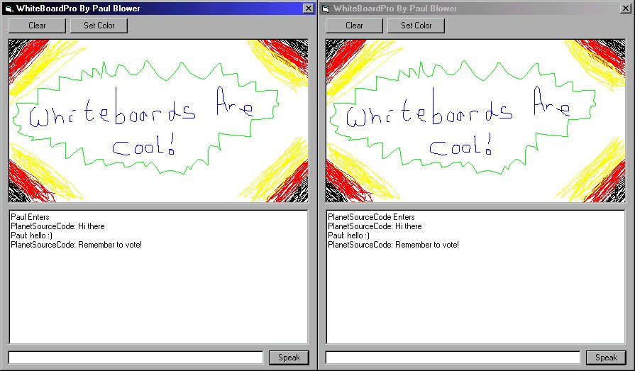



## WhiteBoardPro \- A Realtime WhiteBoard Using Winsock\. A MUST SEE\!\!\!

### Description

This is my second submission to PSC now, and its another internet app for you. Its a whiteboard using winsock... what this means is that you and a friend can connect, then when either of you draw on the whiteboard it appears on both your screens! You can both draw pictures together now! (oh, the fun!).

Its a good demonstration of streaming data, and its just a pretty cool app anyway :). I've added a chat as well, just to make it a little more fun, and i even threw in a "save picture" for good measure :)

Ive commented practically every line of code in this thing, in the hopes youre going to like it so much you'll actually vote for it! (My last submission only got 2 votes, and im still sour about that .. )

Enjoy the code... And remember to VOTE!!!
 
### More Info
 

             |
---                |---
**Submitted On**   |2000-08-30 20:43:18
**By**             |[Mercior](https://github.com/Planet-Source-Code/PSCIndex/blob/master/ByAuthor/mercior.md)
**Level**          |Advanced
**User Rating**    |4.6 (232 globes from 50 users)
**Compatibility**  |VB 6\.0
**Category**       |[Complete Applications](https://github.com/Planet-Source-Code/PSCIndex/blob/master/ByCategory/complete-applications__1-27.md)
**World**          |[Visual Basic](https://github.com/Planet-Source-Code/PSCIndex/blob/master/ByWorld/visual-basic.md)
**Archive File**   |[CODE\_UPLOAD94418302000\.zip](https://github.com/Planet-Source-Code/mercior-whiteboardpro-a-realtime-whiteboard-using-winsock-a-must-see__1-11114/archive/master.zip)

